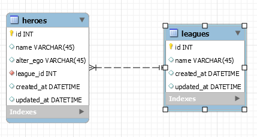

# One To Many With Flask

For this lecture, I have an application (not full CRUD) that the code snippets will be used from. For some context as to what the database I'm working with looks like, it looks like this:

